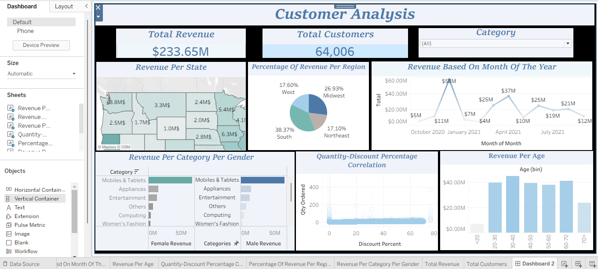

# 📊 Customer Data Analysis Dashboard

## 📌 Project Overview

This project presents an interactive Tableau dashboard designed to analyze customer sales data and uncover meaningful patterns in revenue performance and purchasing behavior.

The dashboard allows users to explore how sales vary across different regions, product categories, and customer segments.

It provides a clear visual representation of revenue distribution, highlights regional differences, and enables deeper exploration through interactive filtering.

---

## 💡 Key Insights

- Revenue shows variation across regions, indicating location-based purchasing behavior.
- Product category performance contributes differently to total revenue.
- Customer segmentation helps identify purchasing patterns.
- Discount levels show a moderate relationship with order quantity.

---

## 🔍 Analysis Focus

The dashboard is structured to help users:

- Understand overall sales performance  
- Compare revenue across regions and states  
- Examine product category contribution  
- Observe purchasing trends across customer groups  
- Explore the relationship between discount levels and order quantity  

Each visualization is designed to simplify complex data into clear, actionable insights.

---

## ❓ Questions Answered by the Dashboard

- How is revenue distributed across different regions?  
- Which region contributes more compared to others?  
- How does revenue vary by product category?  
- What is the revenue distribution across states?  
- Is there a relationship between discount percentage and quantity purchased?  
- How does revenue differ across customer groups?  
- How does filtering categories affect insights?

---

## ⚠️ Assumptions & Limitations

- The dataset represents a limited time period and may not reflect long-term trends.  
- Customer demographic details are limited to available fields.  
- Discount analysis assumes pricing strategy consistency across categories.  
- External economic or seasonal factors were not included in the dataset.

---

## 💡 Business Impact

This dashboard helps stakeholders understand customer purchasing behavior, optimize product strategies, and identify revenue growth opportunities.

---

## 🛠 Tools Used

- Tableau  
- Structured sales dataset (CSV)  
- Data visualization techniques
---
## 📷 Dashboard Preview
## 📷 Dashboard Preview

---

